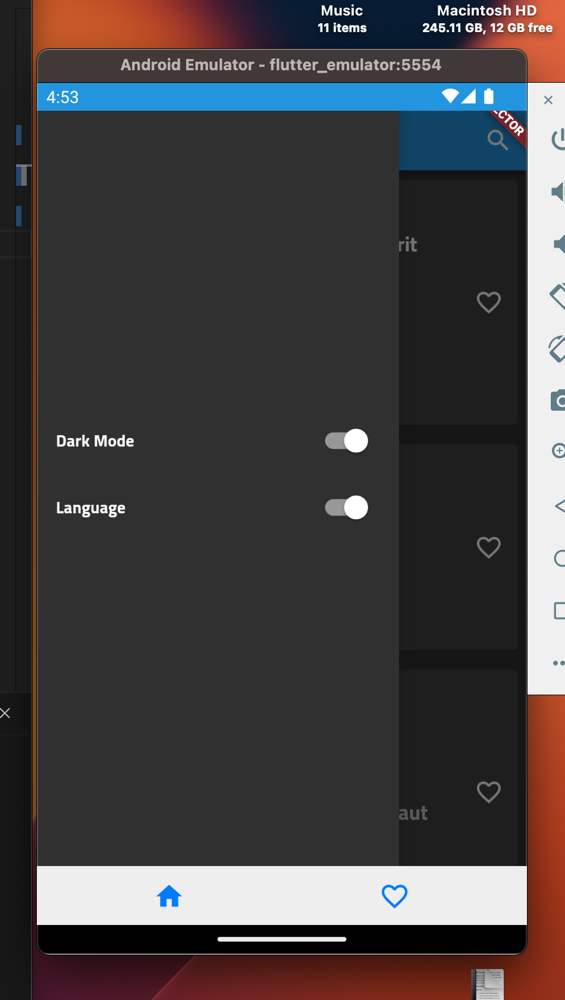

# posts

## Getting Started

add pull to refresh dat From Server in home

add requests_inspector to debug network calls you can access it in debug mode
by long press on any place on any screen

dark mode & language change added in drawer

favorite controller test
